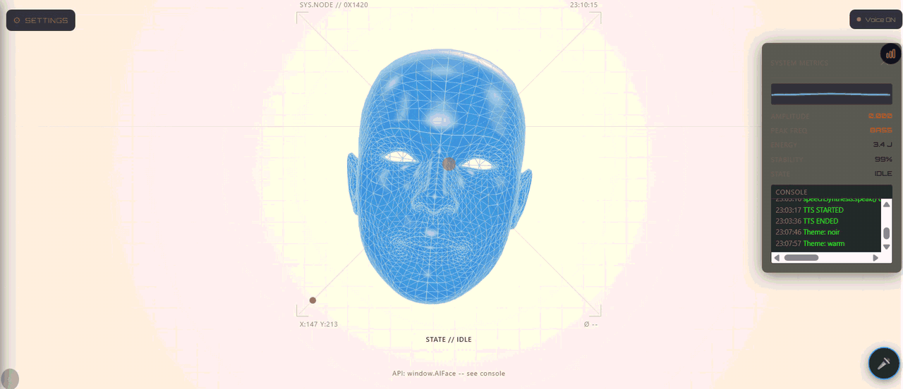

```
 ███╗   ███╗ ██████╗ ██████╗ ██████╗ ██╗  ██╗██╗██╗   ██╗███████╗
 ████╗ ████║██╔═══██╗██╔══██╗██╔══██╗██║  ██║██║██║   ██║██╔════╝
 ██╔████╔██║██║   ██║██████╔╝██████╔╝███████║██║██║   ██║███████╗
 ██║╚██╔╝██║██║   ██║██╔══██╗██╔══██╗██╔══██║██║██║   ██║╚════██║
 ██║ ╚═╝ ██║╚██████╔╝██║  ██║██║  ██║██║  ██║██║╚██████╔╝███████║
 ╚═╝     ╚═╝ ╚═════╝ ╚═╝  ╚═╝╚═╝  ╚═╝╚═╝  ╚═╝╚═╝ ╚═════╝ ╚══════╝
```

---

# Morphius — Reactive AI Face & Voice Assistant

<p align="center">
  <picture>
    <source media="(prefers-color-scheme: dark)" srcset="assets/Morphius_Dark.gif" />
    <source media="(prefers-color-scheme: light)" srcset="assets/Morphius_Light.gif" />
    
  </picture>
</p>

[](https://threejs.org/)
[]()
[]()
[]()
[]()
[]()
[](./LICENSE)

[]()
[]()
[]()
[]()
[]()
[](https://sh0-dax.github.io/Morphius/)

---

**Table of Contents**

[Why Morphius?](#why-morphius) · [1. System Architecture](#1-system-architecture-overview) · [2. Face & State Engine](#2-face--state-engine) · [3. Voice & Audio](#3-voice--audio) · [4. Chat & Persistence](#4-chat--persistence) · [5. i18n & Platform](#5-i18n--platform) · [6. Repository Layout](#6-repository-layout) · [7. Quick Start](#7-quick-start) · [8. Providers](#8-providers) · [9. Runtime API](#9-runtime-api--programmatic-control) · [10. Advanced Features](#10-advanced-features) · [11. CI/CD & QA](#11-cicd--qa) · [12. License](#12-license)

---

## Why Morphius?

**Morphius is a live 3D assistant persona — not another text-only chat widget.**

Typical voice/chat assistants ship a static avatar and play recorded audio. Morphius doesn't. Morphius gives the interface a **face that thinks**: a GPU-rendered head that breathes, blinks on its own, and runs a full 10-state expression machine that reacts to every stage of a conversation.

They render text. Morphius **reacts**.

| Typical widget | Morphius's answer |
|---|---|
| Static image or looping idle animation | **Autonomous idle life** — native-morph blinking + rhythmic breathing drive by real morph slots |
| Blocks of text with no affect | **10 auto states** (idle / greeting / listening / thinking / speaking / responding / alert / error / paying / processing) blended into expressions |
| Robotic, un-synced TTS | **Exact visemes** per phoneme via `visemeFor()`, lip-synced to speech in real time |
| Fixed camera / one look | **5 lighting presets** (Blueprint / Matrix / Warm / Soft / Noir) with smooth ambient lerp |
| Requires an API key to do anything | **Fully local WebLLM mode** — keyless, serverless, 100% in-browser via WebGPU |
| Single language | **6 locales** (en / ar / fr / de / es / ja), auto-detected, parity-test-enforced |
| Text-only memory | **Encrypted IndexedDB sessions** — restore, rename, export, multimodal images |

### How Morphius works

Morphius lives **entirely in the browser**. The face, the chat, the audio bus, and even the LLM can all run client-side with no server.

```
User Input
    │
    ▼
┌──────────────────────────────────────────┐
│          BROWSER APP SHELL               │
│  Chat UI · HUD · Settings · Onboarding   │
│  i18n (6 locales) · PWA / Service Worker │
├──────────────────────────────────────────┤
│        FACE & STATE ENGINE (app.js)       │
│  10-state machine · 52 morph slots        │
│  idle life (blink + breath) · visemes     │
│  lighting presets · webcam face mirror    │
├──────────────────────────────────────────┤
│        VOICE & AUDIO (masterBus.js)       │
│  TTS (Web Speech / Gemini / Live)         │
│  STT (Whisper tiers) · volume · sink ID   │
├──────────────────────────────────────────┤
│        PROVIDERS (multi)                  │
│  Gemini · OpenAI · Ollama · WebLLM        │
│  OpenAI-compatible endpoints              │
├──────────────────────────────────────────┤
│  SECURITY (AES-GCM) · STORAGE (IndexedDB) │
└──────────────────────────────────────────┘
```

---

## 1\. System Architecture Overview

Morphius is a zero-build client-side application. All logic is plain ES modules loaded directly by the browser; a service worker provides an offline app shell and cache-first delivery for pinned dependencies.

### Runtime Request Flow

```
graph TD
    A[User message] --> B[chatStore persist]
    B --> C[state -> thinking]
    C --> D[Provider router]
    D -- cloud --> E[Gemini / OpenAI / Ollama]
    D -- local --> F[WebLLM (WebGPU)]
    E --> G[stream tokens]
    F --> G
    G --> H[state -> responding]
    H --> I[viseme + TTS synthesis]
    I --> J[face morphs + audio render]
```

### Core Pillars

| Pillar | Description |
|---|---|
| **Face Engine** | Three.js morph-target rig; **52 slots** resolved per model via `resolveSlotKey()` |
| **State Machine** | 10 discrete states → expression moodlets; `idle` adds autonomous blink/breath |
| **Master Audio Bus** | Pure volume gain + `OutputDevice.setSinkId` routing for every playback source |
| **Viseme Engine** | `visemeFor(ch)` maps each character to a phoneme morph key; typing burst + hold sustain |
| **Encrypted Vault** | AES-GCM via Web Crypto; non-extractable CryptoKey in IndexedDB |
| **PWA Shell** | `sw.js` app-shell cache + installable manifest with 192/512 PNG + SVG icons |

---

## 2\. Face & State Engine

### Auto States

The avatar transitions automatically based on conversation lifecycle. Each state remixes a set of morph targets into an expression:

| State | Trigger | Face behavior |
|---|---|---|
| `idle` | no activity | **autonomous blinking** (+ breathing) |
| `greeting` | app open | eyes widen, brows rise |
| `listening` | mic / input focus | eyes forward, subtle nod |
| `thinking` | awaiting LLM | eyes up, gentle brows |
| `speaking` | TTS / playback | **lip-synced visemes** |
| `responding` | streaming reply | normal engagement |
| `alert` | new token / attention | brows raise |
| `error` | provider failure | brows down |
| `paying` / `processing` | busy | minimized movement |

### Idle Life (Autonomous)

- Blinking runs on the model's **native morph slots** (`eyeBlink_L` / `eyeBlink_R`) — canonical `STATE_TARGETS` never touch them.
- Blink cadence ~2–6 s, ~150 ms closure, clamped per-frame to survive headless rAF throttling.
- Breathing modulates `jawOpen` (0.03–0.08) and a ±0.003 `head.position.y` bob around `headBaseY`.

### Viseme Playground

Type any character and the mouth instantly shapes the corresponding phoneme; **hold** to sustain it. Included in the Advanced settings group.

### Lighting Presets

`LIGHT_PRESETS` — `blueprint` · `matrix` · `warm` · `soft` · `noir` — ambient colors lerp smoothly in the render loop.

---

## 3\. Voice & Audio

### Speech Synthesis (TTS)

- **Web Speech API** — zero-install browser voices.
- **Gemini native voice** — `gemini-2.5-flash-preview-tts`.
- **Gemini Live API** — streaming native audio.

Output routes through the **master audio bus**: a single volume control and output-device selector (`setSinkId`) apply to every source.

### Speech Recognition (STT)

Whisper tiers `tiny` / `base` / `small` via `localSpeech.js` — `setWhisperModel()`.

### Live Metrics

Real `AudioAnalyser` data drives the HUD (waveform · energy · frequency) with a "no input" state when disconnected.

---

## 4\. Chat & Persistence

- **Multimodal**: attach images → compressed to ≤1024px JPEG dataURLs → streamed as OpenAI-style parts, persisted and re-rendered.
- **Sessions**: IndexedDB store via `chatStore.js` — create, restore, rename, export, new-chat.
- **Chat UX**: timestamps, copy button, regenerate, scroll-to-bottom indicator, `aria-live` captions.
- **Programmatic API**: `window.AIFace` exposes `registerSessionMessage`, session control, and face state for embedding.

---

## 5\. i18n & Platform

- **6 locales**: English · العربية · Français · Deutsch · Español · 日本語 — 142 keys each, auto-detected from `navigator.language` with manual override.
- **BOM-free JSON**: enforced to avoid encoding corruption.
- **PWA**: installable, offline app shell, 192/512 + maskable icons, SVG favicon.
- **Accessibility**: `prefers-reduced-motion`, visible `:focus-visible`, `aria-live` regions.

---

## 6\. Repository Layout

```
Morphius/
├── .github/
│   └── workflows/deploy.yml          # GitHub Pages CD (push to main)
├── css/
│   └── styles.css                    # Design tokens, layout, components, responsive
├── js/
│   ├── app.js                        # Core: face engine, states, providers, settings
│   ├── pure.js                       # DOM-free helpers (feelings, visemes, URL/parts utils)
│   ├── mirror.js                     # Webcam → blendshape mirror
│   ├── localSpeech.js                # Whisper STT · Kokoro/MMS TTS
│   ├── chatStore.js                  # IndexedDB session store
│   ├── masterBus.js                  # Volume + output-device routing
│   └── progress.js                   # Model-download progress → HUD
├── i18n/                             # en · ar · fr · de · es · ja (142 keys each)
├── models/                           # 7 GLB face models + models/manifest.json
├── assets/                           # icon-192/512.png · icon.svg · screenshots/
├── tests/                            # Vitest suites (47 tests)
├── index.html                        # App shell
├── sw.js                             # Service worker (app-shell cache)
├── manifest.json                     # PWA manifest
├── package.json · LICENSE · README.md
```

---

## 7\. Quick Start

No build tools. Serve the folder:

```bash
npx serve .
# or open index.html directly, or deploy the folder to GitHub Pages
```

> Some features (microphone, WebLLM via WebGPU) require a secure context (`https://` or `localhost`) — they may not work from `file://`.

Run the test suite:

```bash
npm install
npm test        # vitest run → 47/47 passing
```

---

## 8\. Providers

| Provider | Mode | Notes |
|---|---|---|
| **WebLLM** | **Local** | 100% in-browser via WebGPU — **no key, no server**; ~1–2 GB model download once, then cached |
| **Gemini** | Cloud | `gemini` provider with native TTS + Live audio |
| **OpenAI** | Cloud | Chat Completions, streaming |
| **Ollama** | Local | Any locally-served model |
| **OpenAI-compatible** | Cloud/Local | BazaarLink, Meta, custom endpoints, LM Studio, etc. |

WebLLM requires a modern Chrome/Edge with WebGPU and downloads weights on first use.

---

## 9\. Runtime API — Programmatic Control

```js
const AIFace = window.AIFace;

// Inject messages that the face can react to
AIFace.registerSessionMessage('user', 'Hello!');
AIFace.registerSessionMessage('assistant', 'And a smiling expression!');
```

Key internal modules:

| Module | Responsibility |
|---|---|
| `pure.js` | `detectFeeling`, `visemeFor`, `VISEME_KEYS`, `contentToText`, `contentImages`, `buildUserContent`, `geminiContentParts`, `dataUrlMeta` |
| `chatStore.js` | IndexedDB session CRUD + persistence |
| `masterBus.js` | master gain, output device routing |
| `localSpeech.js` | `setWhisperModel`, `applyMasterSettings`, TTS drivers |

---

## 10\. Advanced Features

- **Webcam face mirror** (`mirror.js`) — copy your own expressions to the avatar.
- **SiriWave alternative** — toggleable without changing the default face.
- **Encrypted key vault** — AES-GCM, non-extractable, IndexedDB (never plain text).
- **Onboarding flow** — first-run step-by-step setup.
- **Model downloads** — progress surfaced to the HUD via `progress.js`.
- **7 bundled GLB models** including FaceCap (CDN), ARKit 52, robot, raccoon, android, and more.

---

## 11\. CI/CD & QA

Deploys automatically to **GitHub Pages** on every push to `main` via `.github/workflows/deploy.yml` (pages-artifact → deploy-pages).

| Suite | File | Tests |
|------|------|-------|
| Chat store (IndexedDB) | `tests/chatStore.test.mjs` | 13 |
| Pure helpers | `tests/pure.test.mjs` | 27 |
| i18n parity | `tests/i18n.test.mjs` | 7 |
| **Total (unit)** | | **47** |

Per-phase Playwright E2E gates across development phases A–H (chat, multimodal, models, audio bus, i18n, PWA, idle-life, lighting): **126 checks passing**.

---

## 12\. License

MIT — see [LICENSE](./LICENSE).
